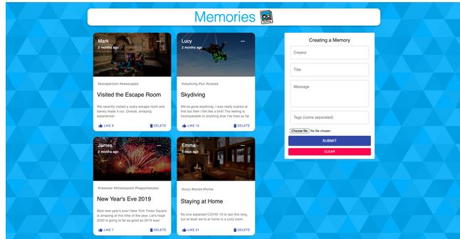

# Life Memories
I developed a Memory Sharing Platform that allows users to upload their memories with pictures and interact with other peoples memories through likes, dislikes, love and bookmark feature. The web application was created using the MERN Stack

# Technologies Used

* ``` Node.js ```
* ``` Express ```
* ``` MongoDB ```
* ``` React ```
* ``` MaterialUI ```
* ``` Redux ``` 

Setup:
- run ```npm i && npm start``` for both client and server side to start the app

Sample Usage:

<p align="center">
  
</p>
